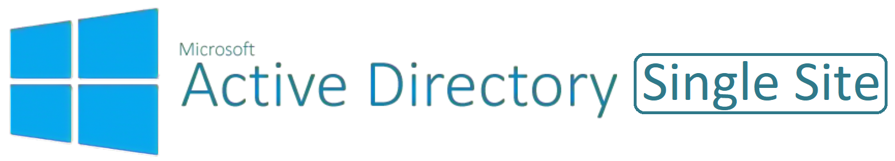

# Active Directory Single-Site

This templates deploys:

- Resource Group
- Virtual Network
- 7 Subnets
  - Gateway Subnet
  - Bastion Subnet
  - Tier 0 (Infrastructure) Subnet
  - Tier 1 (Data) Subnet
  - Tier 2 (Apps) Subnet
  - Tier 3 (Web) Subnet
  - Tier 4 (Client) Subnet
- NSG for ADDS traffic on Tier 0 subnet
- Azure Policy Initiative assignment of 'Deploy prerequisites to enable Guest Configuration policies on virtual machines' [^1] [^2]
- Azure Policy Initiative assignment of 'Configure virtual machines to be onboarded to Azure Automanage'
- Domain Controller(s)
- Guest Configuration Extension for the Domain Controller(s)
- Active Directory Forest/Domain
- Configure Primary Forward and Reverse DNS Zones
- ADDS Organisational Unit structure (see below)
- 20 test users in Active Directory
- Azure AD Connect install on the Domain Controller, ready for manual configuration
- **In Development** **MANUAL???** An AD group Managed Service Account (gMSA) for AAD Connect cloud sync
- **In Development** **MANUAL???**  An AAD Hybrid Idetnity Administrator account for AAD Connect cloud sync
- Domain Joined Windows 11 Workstation

The deployment leverages Desired State Configuration scripts to further customize the following:

AD OU Structure:

[domain.com]

- Accounts
  - Admins
  - Services
  - Users
- Clients
  - Android
  - iOS
  - iPadOS
  - macOS
  - Windows
- Groups
  - Distribution
  - Security
- Servers
  - Apps
  - Data
  - Infrastructure
  - Web

Parameters that support changes
| Parameter | Description |
|-----------|-------------|
| newDeployment | Used to specify which modules need new deployments (default = false). |
| TimeZone | Select an appropriate Time Zone. |
| Location | Set the location for resources. |
| namingConvention | Enter a name that will be used as a naming prefix for (Servers, VNets, etc) you are using. |
| VNet1IPOctet1 | Enter the first IP octet for VNet 1 (i.e. '10' represents 10.x.x.x). |
| VNet1IPOctet2 | Enter the second IP octet for VNet 1 (i.e. '0' represents x.0.x.x). |
| DeploymentDir | The name of the deployment directory within GitHub (i.e. 'ADDS-Single-Site'). |
| AutoShutdownEnabled | Yes = AutoShutdown Enabled, No = AutoShutdown Disabled. |
| AutoShutdownTime | 24-Hour Clock Time for Auto-Shutdown (Example: 1900 = 7PM). |
| AutoShutdownEmail | Auto-Shutdown notification Email (Example:  user@domain.com). |
| adminUsername |  Enter a valid Admin Username. |
| adminPassword | Enter a valid Admin Password. |
| WindowsServerLicenseType | Choose Windows Server License Type (Example:  Windows_Server or None). |
| vmDC1OSVersion | Select gallery image for Domain Controller 1 OS version (i.e. '2022-Datacenter-azure-edition'). |
| vmDC1VMSize | Enter a valid VM Size based on which Region the VM is deployed (i.e. 'Standard_D2s_v3'). |
| Net Bios Domain | Enter a valid Net Bios Domain Name (Example:  'Contoso'). |
| Sub DNS Domain | ***OPTIONALLY***, enter a valid DNS Sub Domain. (Example:  'sub1' or 'sub1.sub2'). |
| Internal Domain | Enter a valid Internal Domain (Exmaple:  'Contoso'). |
| InternalTLD1 | Select a valid Top-Level Domain (Example: 'com', or if dual TLD such as co.uk just enter 'co'). |
| InternalTLD2 | Select a valid Top-Level Domain second element (Example: 'uk' where TLD1 above is a dual TLD such as .co.uk). |
| UserPassword | Enter the password for the AD users to be created. |
| artifactsLocation | Publically accessible location of the GitHub files for DSC (i.e. 'https://raw.githubusercontent.com/user/project/branch/folder') |
| artifactsLocationSasToken | The artifacts location SAS token to access the contents. |
| --- | --- |
| ~~WindowsClientLicenseType~~ | ~~Choose Windows Client License Type (Example:  Windows_Client or None).~~ |
| ~~WK1OSVersion~~ | ~~Select Windows-11, Windows-10 or Windows-7 Worksation 1 OS Version.~~ |
| ~~WK1VMSize~~ | ~~Enter a Valid VM Size based on which Region the VM is deployed.~~ |

[^1]: Ensure the SPN has 'Owner' rights over the subscription and Azure AD Directory Read.All permissions. Further information available [here](https://techcommunity.microsoft.com/t5/azure-paas-blog/azure-policy-perform-policy-operations-through-azure-devops/ba-p/2045515#:~:text=By%20default%2C%20the%20SPN%20created%20by%20Azure%20DevOps,the%20Owner%20role%20assigned%20at%20the%20subscription%20level.).
[^2]: Ensure the 'Microsoft.GuestConfiguration' has been registered as a Resource Provider for the subscription. Further information available [here](https://learn.microsoft.com/en-us/azure/governance/machine-configuration/overview#resource-provider).
>*[Markdown Cheatsheet](https://www.markdown-cheatsheet.com/)*
