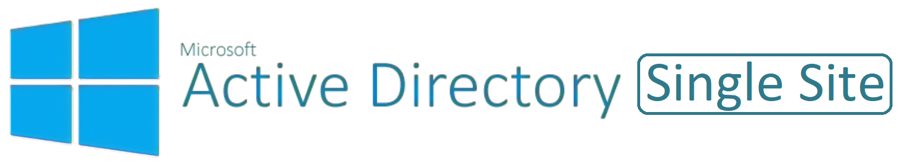

# Active Directory Single-Site

This templates deploys:

- 1 - Resource Group
- 1 - Virtual Network
- 5 - Subnets
  - Gateway Subnet
  - Bastion Subnet
  - Tier 0 (Infrastructure) Subnet
  - Tier 1 (Data) Subnet
  - Tier 2 (Apps) Subnet
  - Tier 3 (Web) Subnet
  - Tier 4 (Client) Subnet
- 1 - NSG for ADDS traffic on Tier 0 subnet
- 1 - Azure Policy Initiative assignment of 'Deploy prerequisites to enable Guest Configuration policies on virtual machines' [^1] [^2]
- 1 - Azure Policy Initiative assignment of 'Configure virtual machines to be onboarded to Azure Automanage'

Parameters that support changes
| Parameter | Description |
|-----------|-------------|
| namingConvention | Enter a name that will be used as a naming prefix for (Servers, VNets, etc) you are using. |
| Location | Set the location for resources. |
| Vnet1ID | Enter first 2 octets of your desired Address Space for Virtual Network 1 (Example:  10.1). |
| TimeZone | Select an appropriate Time Zone. |

[^1]: Ensure the SPN has 'Owner' rights over the subscription and Azure AD Directory Read.All permissions. Further information available [here](https://techcommunity.microsoft.com/t5/azure-paas-blog/azure-policy-perform-policy-operations-through-azure-devops/ba-p/2045515#:~:text=By%20default%2C%20the%20SPN%20created%20by%20Azure%20DevOps,the%20Owner%20role%20assigned%20at%20the%20subscription%20level.).
[^2]: Ensure the 'Microsoft.GuestConfiguration' has been registered as a Resource Provider for the subscription. Further information available [here](https://learn.microsoft.com/en-us/azure/governance/machine-configuration/overview#resource-provider).
>*[Markdown Cheatsheet](https://www.markdown-cheatsheet.com/)*
